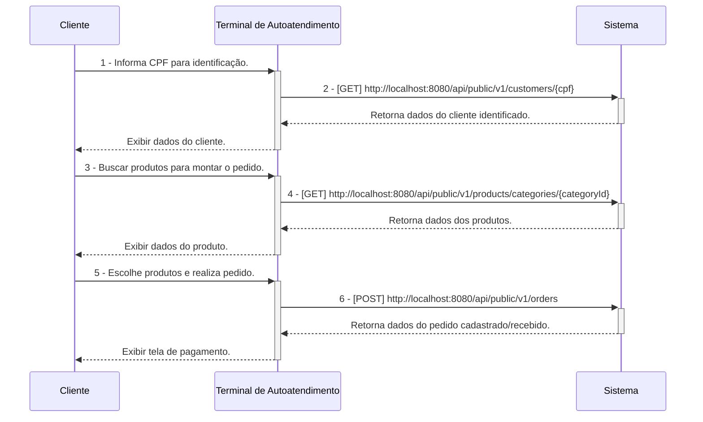
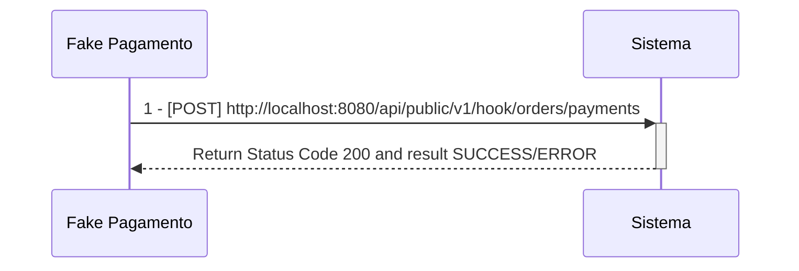
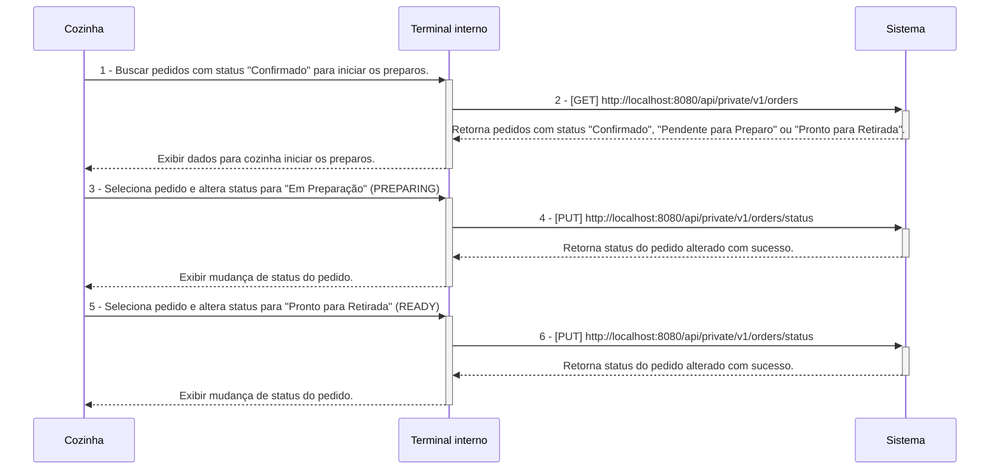
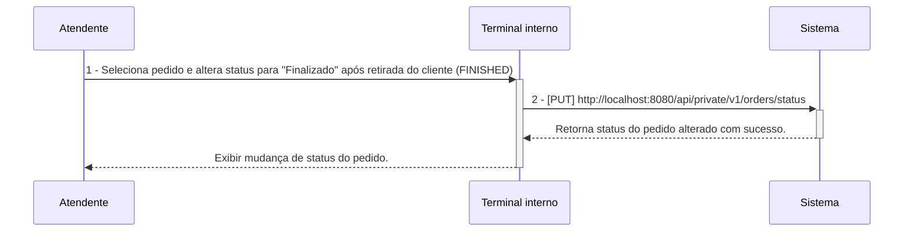

# Tech Challenge Backend API

## O Desafio :triangular_flag_on_post:

Uma lanchonete de bairro está em expansão devido ao seu grande sucesso. Entretanto, com essa expansão e a ausência de um sistema de controle de pedidos, o atendimento aos clientes pode tornar-se caótico e confuso. Por exemplo, imagine que um cliente faça um pedido complexo, como um hambúrguer personalizado com ingredientes específicos, acompanhado de batatas fritas e uma bebida. O atendente pode anotar o pedido em um papel e entregá-lo à cozinha, mas não há garantia de que o pedido será preparado corretamente.

Sem um sistema de controle de pedidos, pode haver confusão entre os atendentes e a cozinha, resultando em atrasos na preparação e entrega dos pedidos. Pedidos podem ser perdidos, mal interpretados ou esquecidos, levando à insatisfação dos clientes e à perda de negócios.

Em resumo, um sistema de controle de pedidos é essencial para garantir que a lanchonete possa atender os clientes de maneira eficiente, gerenciando seus pedidos e estoques de forma adequada. Sem ele, a expansão da lanchonete pode não ser bem-sucedida, resultando em clientes insatisfeitos e impactando negativamente os negócios.

Para solucionar o problema, a lanchonete irá investir em um sistema de autoatendimento de fast food, composto por uma série de dispositivos e interfaces que permitem aos clientes selecionar e fazer pedidos sem precisar interagir com um atendente, com as seguintes funcionalidades:

1. **Pedido**
    - Os clientes são apresentados a uma interface de seleção na qual podem optar por se identificarem via CPF, se cadastrarem com nome e e-mail, ou não se identificar. A montagem do combo segue a sequência a seguir, sendo todas as etapas opcionais:
        - Lanche
        - Acompanhamento
        - Bebida
        - Sobremesa

**Em cada etapa, são exibidos o nome, descrição e preço de cada produto.**

2. **Pagamento**
    - O sistema deverá possuir uma opção de pagamento integrada para o MVP, sendo a forma de pagamento oferecida via QRCode do Mercado Pago.
    - Nesse MVP, será realizado um `fake checkout` para o fluxo de pagamento, sem integração direta com o Mercado Pago.

3. **Acompanhamento**
    - Uma vez que o pedido é confirmado e pago, ele é enviado para a cozinha para ser preparado. Simultaneamente, deve aparecer em um monitor para o cliente acompanhar o progresso do seu pedido com as seguintes etapas:
        - Recebido
        - Em preparação
        - Pronto
        - Finalizado

4. **Entrega**
    - Quando o pedido estiver pronto, o sistema deverá notificar o cliente que ele está disponível para retirada. Ao ser retirado, o pedido deve ser atualizado para o status finalizado.

**Além das etapas do cliente, o estabelecimento precisa de um acesso administrativo:**

1. **Gerenciar clientes**
    - Com a identificação dos clientes, o estabelecimento pode trabalhar em campanhas promocionais.

2. **Gerenciar produtos e categorias**
    - Os produtos dispostos para escolha do cliente serão gerenciados pelo estabelecimento, definindo nome, categoria, preço, descrição e imagens. Para esse sistema, teremos categorias fixas:
        - Lanche
        - Acompanhamento
        - Bebida
        - Sobremesa

3. **Acompanhamento de pedidos**
    - Deve ser possível acompanhar os pedidos em andamento e o tempo de espera de cada pedido.

As informações dispostas no sistema de pedidos precisarão ser gerenciadas pelo estabelecimento através de um painel administrativo.

## Equipe :construction_worker:

- Myller Lobo
- Jean Carlos
- Caio Isikawa
- Vanderly
- Thiago

## Pré-Requisitos :exclamation:

- Maven 3
- Java 17 (Open JDK 17)
- Postgres 15
- Docker Desktop
- IntelliJ IDEA
- DBeaver SQL Client
- Postman
- k6

---

## Clean Architecture

[Clique aqui para ser redirecionado a documentação sobre clean-architecture aplicada nesse projeto](https://github.com/fiap-8soat-tc-one/tc-backend-s2/blob/main/docs/clean-arch/README.md)

---

## Configuração de Ambiente de Desenvolvimento Local  :heavy_check_mark:

[Clique aqui para ser redirecionado para a wiki de configuração do ambiente de desenvolvimento local](https://github.com/fiap-8soat-tc-one/tc-backend-s2/blob/main/docs/config/README.md)

## Configuração do Ambiente Docker/Docker Compose :heavy_check_mark:

- **A aplicação está configurada para o Flyway gerar as tabelas no PostgreSQL. Abra o DBeaver ou a ferramenta de sua escolha e verifique se as tabelas do sistema foram criadas.**

[Clique aqui para ser redirecionado para a wiki de configuração do ambiente Docker](https://github.com/fiap-8soat-tc-one/tc-backend-s2/blob/main/docs/docker/README.md)

## Documentação do banco de dados :heavy_check_mark:

[Clique aqui para ser redirecionado para a wiki de documentação do banco de dados](https://github.com/fiap-8soat-tc-one/tc-backend-s3-rds-iac/blob/main/README.md)

## Detalhamento sobre Stress Testing e Smoke Testing :heavy_check_mark:

- **Dentro da pasta scripts/tests contém todos os scripts k6 para efetuar a execução os cenários de smoke-test e stress-test que foram realizados para configurar de maneira efetiva o os requests/limits da aplicação juntamente com o HPA**

[Clique aqui para ser redirecionado para a wiki de testes](https://github.com/fiap-8soat-tc-one/tc-backend-s2/blob/main/tests/README.md)

## Manual/Documentação de Funcionalidades (Swagger/Open API) :heavy_check_mark:

- **Para todos os endpoints privados, é necessário gerar o token via endpoint login(POST /oauth/token)**

- **É possível acessar o Swagger/Open API da aplicação pela seguinte URL: `http://localhost:8080/swagger-ui/index.html`**

### Workflow de Execução das APIs

**Segue abaixo o descritivo simplificado da jornada das APIs dentro do sistema, esses diagramas servem apenas para materializar a jornada do ClienteXTerminalxSistemaXCozinha, mas em nenhum momento substitui o detalhamento/especificação realizados no Domain Storytelling e Event Storming criados, favor utiliza-los como fonte da verdade**

1 - **Criação do Pedido a partir de um cliente identificado**

**Observação:**

- **Os fluxos de 1 a 2 são opicionais.**
- **Não é necessário informar campo id_customer no payload do POST v1/orders uma vez que esse campo é opcional com base na escolha do usuário se identificar ou não.**

---

3 - **Pagamento do Pedido**

---

4 - **Acompanhamento e Preparação de Pedido na Cozinha**

---

5 - **Finalização do pedido**

[Clique aqui para ser redirecionado para a documentação das APIs e suas funcionalidades](https://documenter.getpostman.com/view/37556926/2sA3s1oXsw)

## Domain Storytelling :heavy_check_mark:

[Clique aqui para ser redirecionado para a documentação do domain storytelling](https://miro.com/app/board/uXjVKuUez2Q=/)

## Dicionário de Linguagem Onipresente/Ubíqua

| Palavra                         | Descrição                                                                                                                                                                                                     |
|---------------------------------|---------------------------------------------------------------------------------------------------------------------------------------------------------------------------------------------------------------|
| Lanchonete                      | Estabelecimento onde a solução/sistema será aplicado.                                                                                                                                                         |
| Cliente                         | Pessoa que realiza pedidos na lanchonete.                                                                                                                                                                     |
| Cozinha                         | Setor da lanchonete responsável por preparar todos os produtos do combo.                                                                                                                                      |
| Administrador/Usuário Sistêmico | Pessoa que cadastra produtos no sistema.                                                                                                                                                                      |
| Sistema de Controle de Pedidos  | Sistema que soluciona o problema da lanchonete, automatizando a coleta de pedidos, pagamento e comunicação com a cozinha.                                                                                     |
| Monitor/Terminal                | No Contexto da Cozinha: Display onde são exibidos os pedidos na cozinha pendentes de preparo. No Contexto do Cliente: Display onde o cliente consegue acompanhar o status dos seus pedidos.                   |
| Promoção                        | Oferta de produtos com desconto customizada por cliente.                                                                                                                                                      |
| Pagamento                       | Ação realizada pelo cliente ao fazer a leitura do QR code do Mercado Pago para realizar o pagamento do pedido.                                                                                                |
| Pedido                          | Pedido de combo realizado pelo cliente.                                                                                                                                                                       |
| RECEIVED/Pedido Recebido        | Pedido aguardando pagamento pelo cliente)                                                                                                                                                                     |
| PENDING/Pedido Pendente         | Status do pedido após uma falha no fluxo de pagamento.                                                                                                                                                        |
| PREPARING/Pedido Em Preparação  | Status do pedido após a após a conclusão do pagamento e encaminhamento para a cozinha iniciar o preparo.                                                                                                      |
| READY/Pedido Pronto             | Status do pedido após a cozinha terminar o preparo e disponibilizar para retirada pelo cliente.                                                                                                               |
| FINISHED/Pedido Finalizado      | Status do pedido após ser retirado pelo cliente.                                                                                                                                                              |
| CANCELED/Pedido Cancelado       | Status do pedido após ser cancelado pelo cliente ou pela cozinha.                                                                                                                                             |
| Acompanhamento                  | No Contexto de Itens do Pedido: Item que acompanha o hambúrguer, como, por exemplo, batata frita. No Contexto do Pedido: Funcionalidade que permite ao cliente acompanhar o status do seu pedido no monitor.  |

## Event Storming :heavy_check_mark:

[Clique aqui para ser redirecionado para a documentação do event storming](https://miro.com/app/board/uXjVK1Bf4Q4=/)

## Domain Mapping :heavy_check_mark:

## Desenho de Arquitetura/Infraestrutura  proposto  :heavy_check_mark:

[Clique aqui para ser redirecionado para o desenho de arquitetura e infraestrutura](https://viewer.diagrams.net/?tags=%7B%7D&lightbox=1&highlight=0000ff&edit=_blank&layers=1&nav=1&title=tc-backend.drawio.png#R%3Cmxfile%20scale%3D%221%22%20border%3D%220%22%3E%3Cdiagram%20name%3D%22Draft%22%20id%3D%22jiXIkiBsy346j2COqR-b%22%3E7V1bd5u4Fv41Wat9gIUE2ObRceKmp%2BlMmnSmM09ZGBSbCUYeLrnMr58tcTFCIrYTiD09TprUbAQI7W9ftaWcmJPl06fYXS2%2BUp%2BEJ9jwn07MsxOMByNjCP8xynNOwUPLzCnzOPBzmrEm3AT%2FkJyISmoW%2BCQpaDkppTRMg5VI9GgUES8VaG4c00ex2R0NfYGwcudE6AYj3HhuSKRmPwI%2FXeTUER6u6RckmC%2FKJ6OBk59ZumXj4sbJwvXpY41knp%2BYk5jSNP%2B0fJqQkI2eOC7TlrNVx2ISpdtcQMZfL77dnDqzp%2BzyIpo4%2F0TGX5pd3ObBDbPijYveps%2FlEMQ0i3zC7mKcmKePiyAlNyvXY2cfgetAW6TLEI4QfEzSmN6TCQ1pDJSIRtDsVO5q%2BVgSp%2BSpRiq6%2FonQJUnjZ2hSnNVsq%2BhZgSTNtAoePK75gofmICcuakzBaFhQ3QIN8%2Br%2B6wGDD8WY7TB%2BZR%2B2Gz82QG7sFShHbDh9N1lUY3sXhGE5dCfYnNrsuxrUEn8mUOahmyTlVTRKa1flXxIr4MyAf7GrY9cPyPqqDtlkmabAJoRMmUu2bctcQgPb6YtLO6H8JS6hBpeKkZMZJA2%2Bwb8Kdt0Uz1UI8c5DXmK7GPAhdqQBR1Z52%2FqAO6NRT%2BNtDqXhJT6o1eKQxumCzmnkhudr6qmoZtZtLildFSP%2FF0nT54IvbpZSleqpM%2BEupI%2FjKABVHNCoaNU64gnNYo%2B88Fa4AG3qxnOSvvT6BUfYO7%2FIwZiE0LUH0dR0zo2y39ujf4OOj2lajqgjSccGXSXLTgci4DiOjkQxQPCtl2qmJgqWbepDR2EjHFvvTR6cwxCH10Pf7hrQxaVXNICuVHxEJhJtPFB0W7xLLn3FhQ2%2BVD15Pat2kpUt%2FKGGSb%2Bz2ferjPYGKevCeJuSj2XIEgSCpTDeI7Mv7bWZIeBZr9hHUPQMn%2FXhZy8fgDc%2FDoM501cpE56KeunOSHhFk6DQZjOapnQJDUJ24tT17uec2XUG8i9owh82TlZ50MGQ4JYHd8ETY9Rp0Z%2BzRZqyaGXMBgJPPT%2By9ADilbsAYBTrHjwRT303deE%2FRk%2FYOAWZNguhA1pCvcAN2TBMB%2BDgT%2BdBushmGsIjfRXN%2B4OCPWxAASuUqcLZtvpytU0JCJ%2BC9CKbAW3sMQYmEjDgZVMRD26BAw%2BGhsQKgCwD3%2Bf6VyXXouRzRy7Xvlh27HpjTMPQaeDxyTJqWDJnTKMnzli7i%2BhrJdAnd24Wpq2SrZZBQUzVUvkADWicEHJfCOTjSgNZTBmn8DRbhdT1mWBiAwMQpwaY9GmOP61An3YJBlr7nd9HTx7mWr%2FyadpNGMjhMEIKt78ido6DgYSDyWe40QQ%2BGVfBioQBOHz%2FFzLatKPIHm1nR3uT0S3yFCvmU%2FHn2qfwz9AZxCYG%2F7GhwYQTnREj6CxxVKPzI32IGo0H8NhJg5i3dGwFdVAR4d8WSiK5J6m3KFi90epLukECGh8BEp8%2FkHwgOEIKzbV8mrMUp%2B4FiUeRo2cJv6Th3xmGbQxlP641TdAB2hzkNMA2sGRNYKkyLpbdE9rK7G0NbtdkHsD7g5NjfGYaGHSsEVH4NQGRdEEzxPC5aPS8Dy3Ru1ZwGnzCA9lwI0dhuK2%2BlEJpCQStMODmFdyqwTzlb54T2BgJPBn8ndHyhJZwHQu21IBResovK86XNzqj3j1n8sVv1U2h1%2Fl9xWcBufb8%2F7q3b2z09gsff0n8wIWYlzlvU2xVJ275iVvhIARn49bnQ9p3LIDMUQO4o4EMXDxSKBjcV0altJ0K5L4ZqL8l2cnEPBmjOKAJc13Y0el4FgK7kg3I9YOHNz27s5f48IOACE2%2F05Rp2ulXOgvgThAqrVYfN0sff40W%2BfsJVPFoIE5SaEjOmeMyAK4DurSs3eN5LxlzVX5cNZXhxumYzaXWPRmgTQP2kvzhrUzZmCxHnSfL1blFyxADpkE5SVHeIk%2BC9pZYRKoouSNhl4z252gek4Qpr69uBGbJV1vW%2F4Yqk97uEmJxuAD0jht5zKXY%2Bd02qDghrmiGRYqYCKsCJRVtKBOR3EyOmfInNIkq2lAmopYYDKtCMBVtaMs9bl6NFFejxtU8qKNZyvIAk6peQzGFDd9TJlrN6Or8bIj4HKqUJa8cNWE%2BfaPn1xIoNu1ZXWWuEwrgg4j2SukWNuNH9zGxdBBOrm0%2Be6w%2Fp3CYfxJbgcJLoHu3LPd0O%2BNoD%2Fpz80xzqDc8PaucOK87eqoKi4rYvWG092EYYRTj5z%2FY9bpdHv5Z3I4fnD0JR8%2F1oysSB%2FDyDDlnhpJbartbs7IemzINvIah3Xr6%2Bo9fYtu9%2FjL5BT3%2F9WN2%2Bcf5n%2BaszJ9vNshW1wb5bQA4kMnTPni2mRej93KOxNkehIzGPfr2juTc8Tt4Rzv4DQ0Iymq%2BJRUp2CMe%2FiRi%2BPNKG9WwjHg0tM%2Fxi5ZRSu8ahp1nXc2GD1EY%2BGbiV0lVpoidlhsP%2BdW642zhyOBRoy33HprW9D6bkTgCZZvwJAsbgVVc2NJebaWYy3Owow%2FlFH%2BLrYQX7stcYuswtGXNgFrDyqIyE4p0A1UtdjGj3RZzlZp1owrGnde%2BvM0cjt5RUd6Q%2BCGAYSzpcZVdclcrLfW0mevdk8jXEqwlD97Ho0b9uTUq8Pi9NCrCQ7lweA%2F6VJ7I6k%2FcZKFarNyjTP2UMrUm8SEt%2BFBJGmN8X9M5eCRWWSK7nK7dr6i952Tk1a9niWzW2imvmag8St%2FBSl8lZyvq9yZnyB7pRqMq3bQPQtRUs6dH9B7RuwG9GCsm%2Ft8fvXIl8BG9R%2FRuRm%2B57me%2F6G3PdLbNuL4YOuzgBBmzqsZJ83IEsvNBBJh2Q%2BWD5JDEJ6sNIclLM6tHuTxYudwQkQDfQ%2FqsFFhpvrQvCTYUC%2Fr2IMHtKTjAaPSmuOSa%2FJ0FScDrz4a87swmrIzj4vv3qw839QRb%2FqgDqtFq1DrXBW29aqMXbW%2BNRJxoyFQtOn%2FPei6zPZjtACMgwwwUPivou6YpcZcweLQVHDXrIpLe3JUP1zRL2TwL9CMLSdIO0AMsLawtY35p84XtVmoWqN%2B0FLq3jRdwqRqrGVxLXgVgYrtcTitsBNBXfbmp8tQ7gt5k4S5dny0n8HmVLrgnhaVmddfvLgnXJKUxX8%2BQd8d3faFY%2BCgN7ykNg8bqOIQdq3II9ikQ7UWgHSDQD2LiAQtLc8DG0OUOPq934OsZYxqGfBUGX%2BlUABZ%2Bfam8Pzj4cP7lUH2NnwqmqFGHPigz8zWI2gbmJZTvh9EOS3FaIs54PvuA2eKzCWtc%2B%2FBRiezx0v2HMuG4PrvZdupLiCt3qjltYXd7gNgMKcsbbVWKWolCU0aqOPalalSV%2FNQrVJXeOjTnpTF5cb%2BqPHUVUz%2Fz0qI6tQoBxRJWP%2BnLn0eO1ShHwwrBqBwcIfDrbacvs8eo79cVAUXdjPm4e08SLw74YrGQBGnG9TnX2uMfN6VEGBr8AKZSpuZvvl0eNXf%2FmttuVkyaiknU93YvLJV78ZJiPK5tOK5t2NPahvv%2BzIdRXlNuiadYxlAalLpclrTu5VLeVSpX3%2BBnw%2B9JmCWMGXvQzzm3LfUyhQ54YSIxEBvaWDbkDjJUanLYm5pUmfLG2AuyVi91lSFv6l5IM19l00a2%2BcJ%2Bm8Iz%2BtlzwDbEsjpLsQ%2BJgxV%2B1Ki3vTgPeD1H64i%2FcoO8LcqLc0%2B38wUd2kDkO26udm3ZRm8cx%2B5zrVmZUmt9DjbF3HuRZJlu2S%2BxOXzIO9Dp2hK7vYbzzZ77WT4rho3P0V3sEoBZljvph%2BiB73ueRjMHli7aA021MVJfMzXWw5fb8MJPR5F96S6%2B4eT7cqr1UHWI7Ba0JMSLSaooPASyD%2BMauGGiscD6WHX4M86wr%2BvoOQ66cHURaoSh1shQJbptrBuKDVrsDlws5WJTvNnDOi7jld2FV61kwrKroeRJP0tHm3uplPu9b1g4qliCikVPFW3nsbzCS1CPzoGsnBO3mn9vhLUDZwuADd4IsDdpHJUdb%2FBTmZ7pO6miDBjdVXA7d1PyyHzdpsU8c8YsY7EhfSkZCQVv28NysAejpuVQRObGSMeKyByhvuxGjwUD46vPcPpTMeoH6aAfWor8bRjDqNpRv4xCVdM4A4W334xWO8OXam7zYLVE6C5nvnt7l0Ve%2FgRlgsnqlYuOJbIQmSNdUYSJVXNxTQveGRd7nIq7dJfRjJcVjTN4u6Oa6FtNOHjQyAng4b61BOrRDP0OyOD4AoYnCa8VA28AurnK2A6TeyhdOw3p3xkJxD7B84tuxcED2MxjKdue5MO2GkXwij97ZiKFdHQxy6yWjv1uySXsJlIL7N8Wy28Mu7aPp7bcYavzSBwZpVv%2BXHpgjWKYllh816S%2F9KBylqmrNL4adu11ad0UEzO11yglZle9f1H9J8LLfP734%2FvHyjpQl7sj0xRwG%2B2ojHvsamXNXurs9IG3OhqR%2FRkRLCbpLEv24a1ym3lxB%2B%2Fd%2F64THK7%2Fqmku%2Fes%2FDmue%2Fws%3D%3C%2Fdiagram%3E%3C%2Fmxfile%3E)

## Requisitos não funcionais a serem implementados no futuro

- Cadastro de usuário sistêmico, hoje temos apenas um usuário sistêmico, via carga do flyway.

## Documentação do Kubernetes

[Clique Aqui para ser redirecionado](https://github.com/fiap-8soat-tc-one/tc-backend-s3-k8s-iac/blob/main/README.md)
