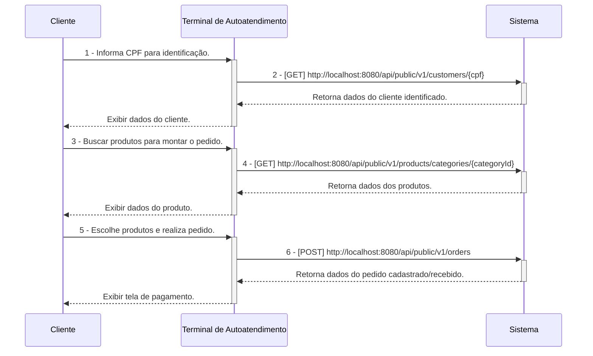
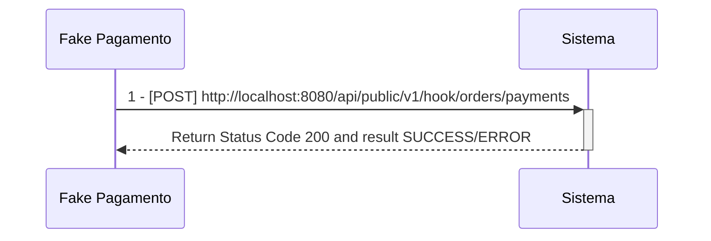
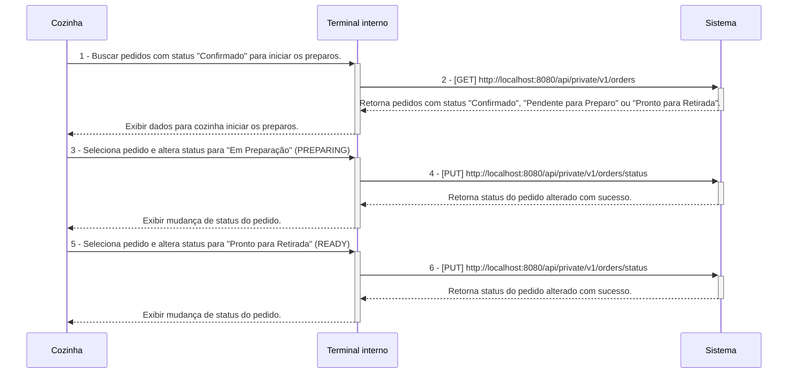
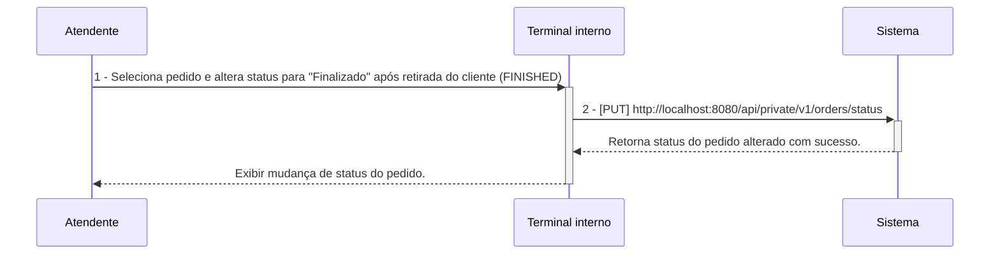

# Tech Challenge Backend API

## O Desafio :triangular_flag_on_post:

Uma lanchonete de bairro está em expansão devido ao seu grande sucesso. Entretanto, com essa expansão e a ausência de um sistema de controle de pedidos, o atendimento aos clientes pode tornar-se caótico e confuso. Por exemplo, imagine que um cliente faça um pedido complexo, como um hambúrguer personalizado com ingredientes específicos, acompanhado de batatas fritas e uma bebida. O atendente pode anotar o pedido em um papel e entregá-lo à cozinha, mas não há garantia de que o pedido será preparado corretamente.

Sem um sistema de controle de pedidos, pode haver confusão entre os atendentes e a cozinha, resultando em atrasos na preparação e entrega dos pedidos. Pedidos podem ser perdidos, mal interpretados ou esquecidos, levando à insatisfação dos clientes e à perda de negócios.

Em resumo, um sistema de controle de pedidos é essencial para garantir que a lanchonete possa atender os clientes de maneira eficiente, gerenciando seus pedidos e estoques de forma adequada. Sem ele, a expansão da lanchonete pode não ser bem-sucedida, resultando em clientes insatisfeitos e impactando negativamente os negócios.

Para solucionar o problema, a lanchonete irá investir em um sistema de autoatendimento de fast food, composto por uma série de dispositivos e interfaces que permitem aos clientes selecionar e fazer pedidos sem precisar interagir com um atendente, com as seguintes funcionalidades:

1. **Pedido**
    - Os clientes são apresentados a uma interface de seleção na qual podem optar por se identificarem via CPF, se cadastrarem com nome e e-mail, ou não se identificar. A montagem do combo segue a sequência a seguir, sendo todas as etapas opcionais:
        - Lanche
        - Acompanhamento
        - Bebida
        - Sobremesa

**Em cada etapa, são exibidos o nome, descrição e preço de cada produto.**

2. **Pagamento**
    - O sistema deverá possuir uma opção de pagamento integrada para o MVP, sendo a forma de pagamento oferecida via QRCode do Mercado Pago.
    - Nesse MVP, será realizado um `fake checkout` para o fluxo de pagamento, sem integração direta com o Mercado Pago.

3. **Acompanhamento**
    - Uma vez que o pedido é confirmado e pago, ele é enviado para a cozinha para ser preparado. Simultaneamente, deve aparecer em um monitor para o cliente acompanhar o progresso do seu pedido com as seguintes etapas:
        - Recebido
        - Em preparação
        - Pronto
        - Finalizado

4. **Entrega**
    - Quando o pedido estiver pronto, o sistema deverá notificar o cliente que ele está disponível para retirada. Ao ser retirado, o pedido deve ser atualizado para o status finalizado.

**Além das etapas do cliente, o estabelecimento precisa de um acesso administrativo:**

1. **Gerenciar clientes**
    - Com a identificação dos clientes, o estabelecimento pode trabalhar em campanhas promocionais.

2. **Gerenciar produtos e categorias**
    - Os produtos dispostos para escolha do cliente serão gerenciados pelo estabelecimento, definindo nome, categoria, preço, descrição e imagens. Para esse sistema, teremos categorias fixas:
        - Lanche
        - Acompanhamento
        - Bebida
        - Sobremesa

3. **Acompanhamento de pedidos**
    - Deve ser possível acompanhar os pedidos em andamento e o tempo de espera de cada pedido.

As informações dispostas no sistema de pedidos precisarão ser gerenciadas pelo estabelecimento através de um painel administrativo.

## Equipe :construction_worker:

- Myller Lobo
- Jean Carlos
- Caio Isikawa
- Vanderly
- Thiago

## Pré-Requisitos :exclamation:

- Maven 3
- Java 17 (Open JDK 17)
- Postgres 15
- Docker Desktop
- IntelliJ IDEA
- DBeaver SQL Client
- Postman
- k6

---

## Clean Architecture

[Clique aqui para ser redirecionado a documentação sobre clean-architecture aplicada nesse projeto](https://github.com/fiap-8soat-tc-one/tc-backend-s2/blob/main/docs/clean-arch/README.md)

---

## Configuração de Ambiente de Desenvolvimento Local  :heavy_check_mark:

[Clique aqui para ser redirecionado para a wiki de configuração do ambiente de desenvolvimento local](https://github.com/fiap-8soat-tc-one/tc-backend-s2/blob/main/docs/config/README.md)

## Configuração do Ambiente Docker/Docker Compose :heavy_check_mark:

- **A aplicação está configurada para o Flyway gerar as tabelas no PostgreSQL. Abra o DBeaver ou a ferramenta de sua escolha e verifique se as tabelas do sistema foram criadas.**

[Clique aqui para ser redirecionado para a wiki de configuração do ambiente Docker](https://github.com/fiap-8soat-tc-one/tc-backend-s2/blob/main/docs/docker/README.md)

## Documentação do banco de dados :heavy_check_mark:

[Clique aqui para ser redirecionado para a wiki de documentação do banco de dados](https://github.com/fiap-8soat-tc-one/tc-backend-s3-rds-iac/blob/main/README.md)

## Detalhamento sobre Stress Testing e Smoke Testing :heavy_check_mark:

- **Dentro da pasta scripts/tests contém todos os scripts k6 para efetuar a execução os cenários de smoke-test e stress-test que foram realizados para configurar de maneira efetiva o os requests/limits da aplicação juntamente com o HPA**

[Clique aqui para ser redirecionado para a wiki de testes](https://github.com/fiap-8soat-tc-one/tc-backend-s2/blob/main/tests/README.md)

## Manual/Documentação de Funcionalidades (Swagger/Open API) :heavy_check_mark:

- **Para todos os endpoints privados, é necessário gerar o token via endpoint login(POST /oauth/token)**

- **É possível acessar o Swagger/Open API da aplicação pela seguinte URL: `http://localhost:8080/swagger-ui/index.html`**

### Workflow de Execução das APIs

**Segue abaixo o descritivo simplificado da jornada das APIs dentro do sistema, esses diagramas servem apenas para materializar a jornada do ClienteXTerminalxSistemaXCozinha, mas em nenhum momento substitui o detalhamento/especificação realizados no Domain Storytelling e Event Storming criados, favor utiliza-los como fonte da verdade**

1 - **Criação do Pedido a partir de um cliente identificado**

**Observação:**

- **Os fluxos de 1 a 2 são opicionais.**
- **Não é necessário informar campo id_customer no payload do POST v1/orders uma vez que esse campo é opcional com base na escolha do usuário se identificar ou não.**

---

3 - **Pagamento do Pedido**

---

4 - **Acompanhamento e Preparação de Pedido na Cozinha**

---

5 - **Finalização do pedido**

[Clique aqui para ser redirecionado para a documentação das APIs e suas funcionalidades](https://documenter.getpostman.com/view/37556926/2sA3s1oXsw)

## Domain Storytelling :heavy_check_mark:

[Clique aqui para ser redirecionado para a documentação do domain storytelling](https://miro.com/app/board/uXjVKuUez2Q=/)

## Dicionário de Linguagem Onipresente/Ubíqua

| Palavra                         | Descrição                                                                                                                                                                                                     |
|---------------------------------|---------------------------------------------------------------------------------------------------------------------------------------------------------------------------------------------------------------|
| Lanchonete                      | Estabelecimento onde a solução/sistema será aplicado.                                                                                                                                                         |
| Cliente                         | Pessoa que realiza pedidos na lanchonete.                                                                                                                                                                     |
| Cozinha                         | Setor da lanchonete responsável por preparar todos os produtos do combo.                                                                                                                                      |
| Administrador/Usuário Sistêmico | Pessoa que cadastra produtos no sistema.                                                                                                                                                                      |
| Sistema de Controle de Pedidos  | Sistema que soluciona o problema da lanchonete, automatizando a coleta de pedidos, pagamento e comunicação com a cozinha.                                                                                     |
| Monitor/Terminal                | No Contexto da Cozinha: Display onde são exibidos os pedidos na cozinha pendentes de preparo. No Contexto do Cliente: Display onde o cliente consegue acompanhar o status dos seus pedidos.                   |
| Promoção                        | Oferta de produtos com desconto customizada por cliente.                                                                                                                                                      |
| Pagamento                       | Ação realizada pelo cliente ao fazer a leitura do QR code do Mercado Pago para realizar o pagamento do pedido.                                                                                                |
| Pedido                          | Pedido de combo realizado pelo cliente.                                                                                                                                                                       |
| RECEIVED/Pedido Recebido        | Pedido aguardando pagamento pelo cliente)                                                                                                                                                                     |
| PENDING/Pedido Pendente         | Status do pedido após uma falha no fluxo de pagamento.                                                                                                                                                        |
| PREPARING/Pedido Em Preparação  | Status do pedido após a após a conclusão do pagamento e encaminhamento para a cozinha iniciar o preparo.                                                                                                      |
| READY/Pedido Pronto             | Status do pedido após a cozinha terminar o preparo e disponibilizar para retirada pelo cliente.                                                                                                               |
| FINISHED/Pedido Finalizado      | Status do pedido após ser retirado pelo cliente.                                                                                                                                                              |
| CANCELED/Pedido Cancelado       | Status do pedido após ser cancelado pelo cliente ou pela cozinha.                                                                                                                                             |
| Acompanhamento                  | No Contexto de Itens do Pedido: Item que acompanha o hambúrguer, como, por exemplo, batata frita. No Contexto do Pedido: Funcionalidade que permite ao cliente acompanhar o status do seu pedido no monitor.  |

## Event Storming :heavy_check_mark:

[Clique aqui para ser redirecionado para a documentação do event storming](https://miro.com/app/board/uXjVK1Bf4Q4=/)

## Domain Mapping :heavy_check_mark:

## Draft proposto para o desafio da fase 4 :heavy_check_mark:

[Clique aqui para ser redirecionado para o drasft](https://excalidraw.com/#room=788c047a84a1804ccff8,z7B6WGLVRFSn0qvuE8mKnw)

## Desenho de Arquitetura/Infraestrutura  proposto  :heavy_check_mark:

[Clique aqui para ser redirecionado para o desenho de arquitetura e infraestrutura](https://viewer.diagrams.net/?tags=%7B%7D&lightbox=1&highlight=0000ff&edit=_blank&layers=1&nav=1&title=arch-fiap-v41.drawio&dark=0#R%3Cmxfile%20scale%3D%221%22%20border%3D%220%22%3E%3Cdiagram%20name%3D%22Draft%22%20id%3D%22jiXIkiBsy346j2COqR-b%22%3E7V1rd5s4E%2F41OSf9YI4kEJePjlNvu9u%2Bm23a7e6nHAzYocHGyyWX%2FvpXwoBBEgbbYJOUZJs1MhchzYxmnrnoQp4sn38LzPX9Z992vAsE7OcL%2BfoCIQhUBMj%2FadPLpklBQN60LALX3rSBbcOt%2B9PJrk1bY9d2wrRt0xT5vhe563Kj5a9WjhWV2swg8J%2FKp819zy41rM2FU%2BoGbbi1TM%2FhTvvu2tH9plVH2rb9g%2BMu7rMnQ9XYfLM0s5PTG4f3pu0%2FFZrk9xfyJPD9aPNp%2BTxxPDp85XGZVnybdyxwVlGTC5zx5w9%2F3V4Zs%2Bf404fVxPi5Aj9GOL3No%2BnF6RunvY1esiEI%2FHhlO%2FQu4EK%2Berp3I%2Bd2bVr02ycy7aTtPlp65AiSj2EU%2BA%2FOxPf8gLSs%2FBU57YrvavZYJ4ic50JT2vXfHH%2FpRMELOSX9doSVtGcpJY1kJZ2Dp%2B28IE1WN433hUlBUEtbzZQaFvn9twNGPqRjtsf4ZX1oNn50gMzASqkc0uG0zfA%2BH9u563nZ0F0geYrpbz6oGf3JpGXhmWGYXeWvosJVmx9uKsg3avJDrw5M23W2V7U4TTIApWmCUDRLKuBnSYYG7GiWDG5OHJtweXroB9G9v%2FBXpvd%2B23pVpvrtOZ98f51O5Q8nil7SyTTjyBdxQnHSKsc39OPAcna8AN6cR3u9cxYCxzMj97Esu0TDmV5647ukK%2FnsQRmWeYy0SLh8l8gMFk6UXsjMS96Tw6cKtyyPGJaaY%2Fp7ENPknLrn5O7DPJyMA5jnHoh45oG63BHvoPoJISvbmn50l8liWhx%2B%2BvIuWU3HnrtYkbaIMk%2Fe%2BsmcOd6NH7qR69NvZ34U%2BUtygke%2FuDKth0Uy2cUJTH7IKcnDxuF6s%2BhTSjCzg7n7TCfqKu3P9X0UUW1hTAcCTS17pUgu0RfmLiGjQLLIE9HUNiOT%2FI%2B2h3Sc3Hg080gHRqFvuaZHh2FKpdZ04Ub38WwEkS6tV4vuSAFrDCkgnhQUwWKndLXUyRwh%2FOZGH%2BIZaRtbdAJDjjDIy0ZlejBTOrDI0DiBgECWrm0n8lfE12XOpyycSl%2BUH6cP75BHocrISA3xPAoUwQIHulJC9mfRQznQduZm7EWVnC3mwRKbirnykZzgB6HjPKQM%2BbQeEV6M6Eyhabz2fNOmjIkAIoQ4BWRJn27ob5RS3%2BgTWaBHfyf3kcLHxahb%2FpQxSwa8ogMhFIhq2JWao3J0MPlIbjQhn8CNu3Y8l6h5vwSPsusoxHqzdbQzHm1gJ6ypTpU8F1%2BR%2F4BESWwCkn%2BYnDBJGg2dNkjUcCu0J0eSBpmTVfLYCdO4OdPAglY1byT%2FNRAS4YMTWffpVNeu%2Bpxs4AgtGQEneP%2FobAYioZBUci2fFxRjkCw3tHxoSHGYXMLodwBgoPF6XGrgdEJtBjQYYlMVXhIoWCAJFNwRtWXoSYHcvjgLl7w%2FUXLARyqBiYwFK5%2F8mRCWNIlkCMjn9KSXc0iJzqWCwcwTUvmFGxqChVvpSihAEfqiJssrUavURZS8%2BaaBjlFpTtT%2FYj%2F7YhQmMpaspYCM0vPmsvT77EbXvvWQTPKHb%2FlNSa839y0%2FizQXnv%2FatX1Qq%2B2nOv7SsV2T2LxUeZsiJf%2FiLvnirnTgEWXjzk6GtGtbAMo6Q7i6yhMu0gUCJmtsn3JFZmFLhPotjC8m8sUYBq4fUtWFHl2NZx6ZrrCGcm338ahnt%2FYSl98dwkLTr35EJe30sz9zyZ2IqbRev6vnvuQ1KvjvDYhiXZWZJdPg1bPMAC4SdLaytk%2FPGjfOJ4AI557%2FNF4RwZVKRPGAh5EZRGPqyyhqMqRt6tKXTB5eOSkbuG7Xm6eypGtsUQFlg0mVtfItNiBoZ8AiFFnJLTE7t2h%2FXC0CJ6TC67O5IsuSLV5ZX4co497uE7HFyQVE7pgri6oUe79bjYgr2RWsWSSwiZDIUBK1aXwj5E%2FjbabNE9hGUZvGN8IKGwyJTDBRm4b5HrNXQ8HVkLk6Mer8OKI4wCT3lwpcSOR3SlmLta7eX2sQAM66KipqJX9WreZXYSiy61lRZG4BBaKDlNcroVrI2o%2FmU6hIhDkTafPRov25IoebT%2BWziMALSffuKPZ0N0uo3e1OzZNlTWI0PUWBvKIn8nDmje0vjPgcCyMZxeDlH3q9hLPDf9PbJQfXz6Wjl%2BLRjRO45OUp5VwD4WyJ193CKmtR96prMQst3DXRRR%2FeP%2F8LsPnlj8n%2F4MuP77NP%2F7z%2FV55l%2BHn9gqy0vSA3JYA%2FVRQ%2Fmdfe4tto5vxjfJt8vP85gkA9BwWUJw1XTNqPeLnOOrJItNlG83NWRQgqelkTgphVhTr2sWZWoUAVCtfm6ihl4YvzX%2ByGbmLAaYnhhh2qB334%2BvXm8rZo%2Bmwe1SMjhwELi2vf1u3RiehXdManBGX5zAaR0sSpNKhpg5rWAzXtIeyKMaGeXZNypi4bWUBMgTV1gZtPb2FBFnMmHyIz%2Fn5LGt7%2FQf9OvDik03E2P58i1rnamI08mCybDYWfC2hAIAmcLVpn3nfRasoMfondiloOT%2FWyZHl%2BbPNcPcU6lndE75We0ZFfVS%2F7VSHiPV3IELhVoW50Nfo9ie0TaaeH66K4oa2QhZ92rbOO1LLvDDXUWIk9Zb4UTkuVhOrnILmsCWG1eLvafpVPJx82HWg3QpH3rbamPV87a8%2BnA%2FZxNQ9Mh5BZHMXUZztozSJxpCpS2ZQaieI8utKbhVa%2ByC824Cd74ic7XY5FoSicAngamcg6sSATgVvhzxA4RsqLqgI7QwPEw6X0YwUtxVefBaETuMyE57UOFB0lcRpk8AiNya5NQKFua67du4UZOU90VWY13GtjrCmwWsNtYc2QMZL0shEBs2DBohEBdAkJjAgIW7AidqHDXSgV45uP5Ovf0lHvpSoR%2BFHG6bvyoJolbbD2kFjcdEhjCEp62ZGTowFFGlMFegmrV7dGX3xscI%2BlhGcuZ7Z5N49X1uYJQltY6XQWDaU8hVDWBchPbgGXpURXs9ghcP%2FJXK7IoJNTxjF5u0FMdC0mDKQy1gvSzi0lYIfL0N%2BEMhL6IhMehklkH9EGSDfXMQ3tq6S4QjRMuenoHl15%2Fn%2Bx45b7RJ6fditwH8maWdOvXgXrvSn%2BwEoZCoKCfG8ZCrjD6EpHO3MsRH6QWPJbw%2F44W77W7KqcyjNEMlR41EGmlr9kGhgTDlNhi%2B8LT3IPwsBgqOo4wFFMdiLdrSUROLk3lyYVe4nsc1Z25sYdn0EeX%2F7mJPkpv3%2F%2F%2Bi5fHXwzUUemEaHb1Z7CuMOu5qvZrs5OH5OzhkXkfIsIKoN0isBjqGT5PeXUiRYS6sUBVfWWWLliSE2Fg8J8GaDBWBcrhxTmtr0xh7IBJF0B%2BU%2FZhQ41LEuYx1wU0qwZAmUXIMloIVFOOBkiuL6rsGlzvR5F1mhmWg%2F%2BfO5azihUDo0L7zrEe3S%2FNg%2FoW40g46M%2BKhJIS6hDQv9hmf4PRCIYYYZ0Db9HnNAqBspwSbkA4E2urMyEFKXxPmy6rrBVmNhrVNxYS66WDKNBXBPSmXOTYCIWZHmIZ06wImphmKTG0RHYNiVDms7DOkgDbig5dBXVoWqqhNBWXJQlNgJYEQEv4jBoMiotREILRUW1acxxx9H8ePPndZ7pNgs4LuVaDsnjHJixt8yYs93atztjO0zWW8RgnLrRD15rEHw6kO9Aviz5ahroBfk2KGI2kO9Avpz0RXIvyLcab6rKSd1pUeyhB4FZXgViZG1IkH7vrghRm57wQSKramQ76xrrZTBTXiVv1pgp9iZ%2BUsS0HGTWFRdjQ5QicHouFlWcOtJegbjCXgkdK3AigclCmm0yvoR5w1Fg11XvGOyV18mVOf9t6KAVzgKKBAo%2FiAEFEJQw4bTsh2c4jCQgKImDW3AOimHdvSrXvkZcV1FlyZC3Y14OvYeaTrQXzM1YA4QXGTgPmGp%2FXqq1mc4gXuoFGsDdQT73RT6fD9zVFCxpTCwkEAVDnlw9gh3oRwOeO%2FDfuRAFFSFJr16dDdQLpmuQKzvQ8UDHO7RMQ1Bm%2B%2FR0bAx0PNDxMXSsZ4boWekYVecy9xfqTa2rAeR9q%2BzZL5C3hpHVLNb4vIwsiioc0N6BPV8F2ot1yKMEGObsckZYN1Ps3i6sa2hMHQNNBX0EclF1AF5nQK4f2E4wILmD7O2L7D1jmC7Cyo6ofiKv%2BdI7Z9CDqqu8D6juwIuvDkWAUIYSCx0YveC0IchxIN79iVfTBJujnZ54G5RDGYh3IF5W8qI%2BOB9Qtee6v6BtZkkNqO1bZcp%2BobYi9lWz1MLzsm91EacBqh14sudQLQQ7k%2FvJWqH3AbaVRY7NNwXbQk1ltpHRNEMC%2FcNt5WrXVGe47dp8WTr0FgNyO4jifoji8yG3CCjqTpGtqb1IWJJFrrYBux248bUiCAaSJb0QOMLUMzRgT%2FhO5FgdSHkg5eakrBmoH6Q8FA4ZSPk4UtYV3A9SFvnX%2Bo7ybu2uAed9q0zaM5y3hp1VmijeB3auTkMeUN%2BBQ%2FuO%2Buo62gkhKJoEeoD6itKyDgQMKhbBYDG7RLSI8ISeXPjwTsiJ46X506elpr9c3%2B4PO%2B5dprqdTl8SJowWgXP716fqDbsbLeMlmbDXlsYVJaGrmZsVB9mNGm1gk5fLZkVNLoN27WEjch0UN0AWVdmmMtBdLdKVUbj78Trw7diK0s2Pc6Yu75Bsd7f3MSaaMNIrS7AoUOBNzbYNL62rWmdlIgFHcb3Z%2FNV5dqN%2FCp8LmzaQo%2B2eDfQg27KhctaKW9ftKipe3JJhp4TsfEsGsmJIMpPSgQxFyghk310SoaYb3A1lALgbtrdbopjk4C9Ccl1TiEqIwVDK8wnVXFnflz5Et5N1lb1d19TBw01vkzpqBU22e1r3gsYgcoFRR6GsSMg4UNCIbihjg7th16Qkvy1SanVL4iPoEp%2BILg0D8nSJj6BL0Q1l7fR02SDuv6T2s1a3wFxGIhta1KbxjZA%2FTWRLiwxsUZvGN0L%2BtA0QgAWNojYN8z1mr4aCqyFzdWL%2F72VFFY0ij2rkI9sMHi7pKQjNZWdjCCZmlGbN5%2B92WlhdbwVaNJkQYzLRR%2FKIk8hqCpwNR6VmEzkU2U22b8UUqbZnd09udH%2B39FcLnxxY%2FnJN2H7mem700hpCqUrF%2BgHlqFSxHZUxehmf3CGFjrOjOgAn6zCJMjmmRJaQ46MZXI5GCyf5Mr0ko1OI6O%2B7GrDlOp3d69leCGclDvOaBuHyMyVl%2BuZgfPPx3QEDUIPpdLwbWaXEmpv0Nx8Ex6a%2F71ri0Q2%2BWWZMnNl6BcZEii4JWFPuCtFUqnM9BkRzQDQHRHOvSj5Q3%2BXEKMAFZ4Q0q7NDBoYfGH5g%2BP2SwJAmNVG3T8zjLbopaxMNbp3g0bXyHWi3sQCXwp1TwkeryDD1eQknDwvYGJKVVD6EBdSHBTxaQo7zmJHOBUUngTsK1AR7p%2FQhQxOLksfOxp9ZucuBMwfOPAlnKrrK2sJQhX0oH45PmUpYy5h5SYOBMwfOPAlnGppc2hQJMkwKcB4OcV4%2BRX3i00JQ%2BsCpA6eeRrvVdGJ5FliVqbHaj%2FVUrVZ098ZtWD79c%2B0E5sVEvhhr9O8VdkJyuk34FDihFbiRSbrsOW4Uk9MQWPnUYfH9NsOZwIj8S0Gc8PavT5Ugzmm9EwwEUqgKwTovCA9OMf294BCizQ%2FHtSk%2BVFdZQowqtUCzGOpcCBUSlGuTsZzwOEuqbCRee2RaXfl3INNfjkwh0Mgagyv96Ujny2MirEuZK61IsrrcFclW16E9I8kK%2FeIDnXZEpzo2drmbkADrQhgLRavWVXEeVeRfZmjgdddJ0pXMqZcPvCoQEFm6bUn3gqqU7Szb%2FshXO%2Fp6mN8bOLYb1lhOQz7vqzScepbPK8uSUR0sBxVNykTUeXdXrzadjo8WExQr4uGN6pYhnfdNMehJqmJoxKZTKqFFJFPbkA%2BOUfUkPJnlPLUzwKJB3W53aS4cloA58i5QdJmOrkWCjQ1NTp9x7S4XVNd2Z%2FRtQsskOvh0Ylr3zt0XumDe3WziH6TwcdHOPCF5Q0ElmWiIShxkTsyShY66kobVjpmjzR1OrCa6CIVya%2FSRnYbNIO%2F6L%2B%2BqkNw25J1Cho9xn%2FRjS06Nl2hD3tfxeV%2FqifIREeDsTQAZ671pyhcCsgQRI%2ByB2jTleRwE5kvhtFR%2B7Og6%2F7is73t1MS3kueWCTU9aTUPL1I6TrDjjYGn%2BdFYUV7uKyTJPLv5K2IU%2B5ffvXy9oPsL01gnDBJSTKd72LYyTAxi4%2FjHLVLf4WxsKiU5EvF5lr0Fd2wZ5nTGNQu%2FQ0cVRy99kimyzSBvkb0Y3ZTKx6Z%2F4V6EVCHBZVBBJwbtBFXBi2jil7jrQRlVuBjCIdlkpR2QVl2AhXqScnGyQgGxaQs57AZxDFclM8LwMFCQJ9hU4PXquV7uE%2B4iem7OZGy3%2FG4pivlWbtWcgOib6FWZYV8b9QM71atd4J8j5UOb%2F12XL00DniKouVaF%2BMlB5HffUuLleXeChA3w2W%2B0GiPbN81WXEC3GioTLGC3SZF7zP8MSpnHEOmC0x2O0mVLfeW0uFTIuNAMwpNK4KpcKNUllAFBDUOeyJYxW%2FLy09%2Ft0UgYIMHzQAUqrV2c6t6%2FrDVrdr7b6dKrVqawB1QM9zjhl1NHATwM%2FtcdPqkF6DauqifeDuxpAutlwZlFGtcSYpJ1d5ZBhRme2MzfjhGsqCiWy7JI8cJy1gottENJ9FK3DhJenNBiJaJVP7oNkkaejKZnXiE4amsZrzzfplh%2FT5Dr6ITPUdBUC6ce6pRAlqMoKM7dAMLco10hKEUpaV3P7CsrpbtX0fwvf1KrsVCoVlXYqRQ7Q20OiokZEB%2FSfSINF3QuulTVPXS97pUoKqa1Rn3FTvR2gnsgOQEBQO1o5okav6Iay2rhG777WgMFwGjSAsbOD7AVIP4UVkCUVvh7eA015jy7cr4H3Mjdof3gPMAYpNA4Nk6JBJgxVs17ftiKk8kSsvNNI29k37ooTcVx1dJTY2Vmt%2FTc2I9QKM%2BKLYzmzJDnxkZBtEtlAj4hmMneDZSGRcRP2sDYX5jI98fI2tpwwpB%2F9mPyZmt69uV9JW0budBsHsTt%2FcY7p78We%2BYstaGSGztKgAEVVdFkUPwHBDtY%2BTiPbWXT6tDR6E888N4nBKRPp2rHdJA5n7ruUZgPXpIeTzYzQ892Va7lmQE%2Fx4ufthVsqHoj1OGJVBXmypyfW6jrMQwmCXy%2B1W9E1CTFKRy%2FqDhiirOIKCGPuOc%2Bpzkm0UptXP0vBaVVF2ouygoPS1ORn16DX6pk1KU1Z29GmoEGUedavoh68h5CCRHc78W5Uhsj7MhBDgz2lFDlHHvNlKKuEsz8ooKH6u3VMChDs9Bz0Q9saTIKTaVlQUxjxpAvSNE6uZuV37gOZVhiuuU1QtAY2ZsBgBXRHn6reAzMAZm6rYUndb0lFQFF4jQgfql%2Fphiq624n1KwhEWQgDNdQrWLqh8SqReqCCRUV4%2Fd06p4UeODkSSS1wcvyIl%2BusI4tkEaikkKInwRl%2F%2FvDX7ZUxe44%2FfVhNjJ8r8GMET%2BQgwLg8oxCz4ZydzygeZrRdl0%2B2oVo%2BpUozP017U9qDwN03NaV6xpRbLm3m6j5gSoVvKlcbDEcDs1%2BcRWDmWOwXP3I4bV60oVQbu2Bx%2B1l98eOIbrZE%2BhF7TnjkplYD9nv47hgyk5oMsn2iiikJOIv4KGpPRgu5yDvZ%2FST19j%2BuqKOhrhjkUEb%2FlceCJju7NSijH2zoOxcgnjOP2uE0Qytn0hkChOr0uT8wDbE6sQ7RfsyRSAfhp7vzyCSYatm1kUlaUxu2sU5zHB1AcH5dUmmgS9INK5tPJCMZbezotiKSjDqayUeCDUfbExDzO8ixm6Q3RREws%2FUB0WQZJ21bKVwAMpatklbQqu7asRfg1JZt%2FvLlC7qJUoPZJijnZqGmvFHDaWZgCTjIdPS5JeIg1dKd2fysHKRw5pt8YBAmZqspYtxRBiTXZ7mOGzLf58EX4JRQm798%2BYKu2KeBM6JcgohQaHFH35IRJagiVOYU%2FYIpO9TIXivi0hVWGe3GjRkR1WSVPAYBvR0NkqEULSvaXSpdlCUeFTVIpEAGxmjNVssi8LsBLGw3cCwinXJ%2FeR6mmBhtI5oPFPieR7RA2kiHPK819kduDZCDy%2Fd%2F3FaDDAOc0BacoOmglkYxQMJEuDbwBOXv6Nr%2Bc%2FL09P3p6enhv9XkuzIa9WRZ7odmyyzCgvnuQLPV2AWFzWho7CpVIIfQNvOS7q%2FXsp1W9N3JEXzfmCuOXjeF1C1aNbuqhZOVdrRN20%2BQ5OTvx8hZhZnYzeJJ%2Bl3ckZNojfhgm%2BzD7H%2BoZOEdxX3loCBS9oD6jTSz1afTsiUainZ99m1amO39%2FwE%3D%3C%2Fdiagram%3E%3C%2Fmxfile%3E)

## Documentação do Kubernetes

[Clique Aqui para ser redirecionado](https://github.com/fiap-8soat-tc-one/tc-backend-s4-k8s-iac/blob/main/README.md)
