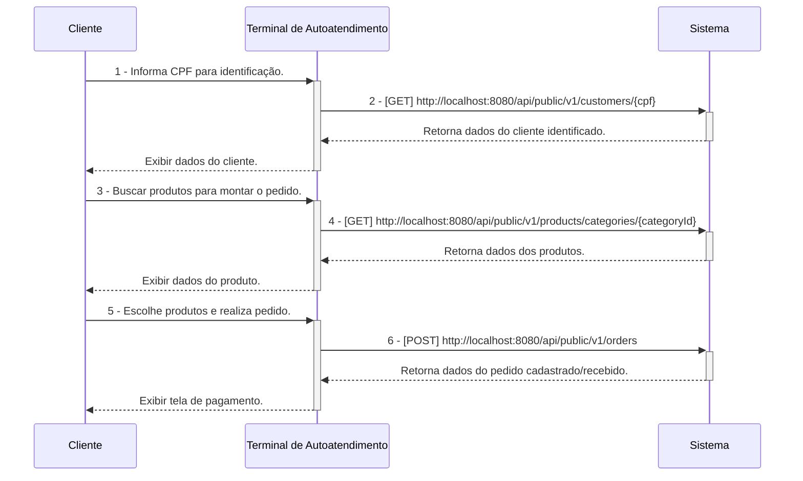
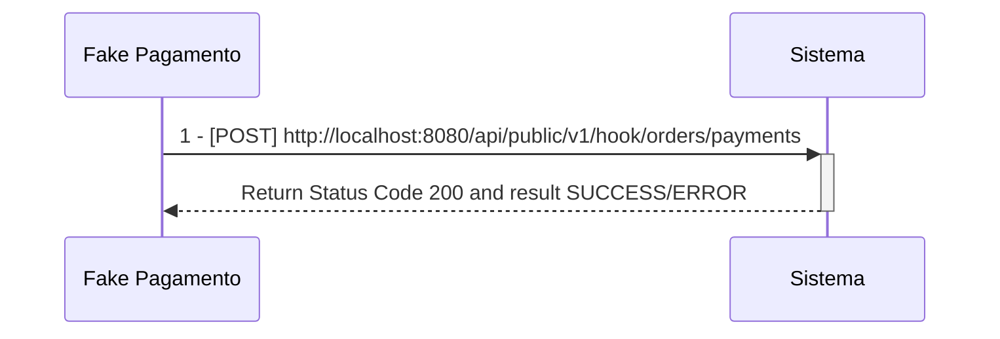
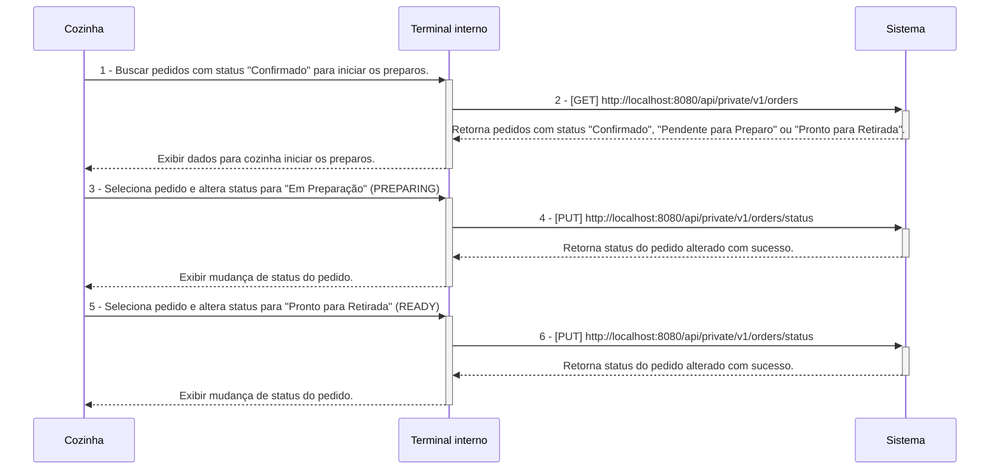
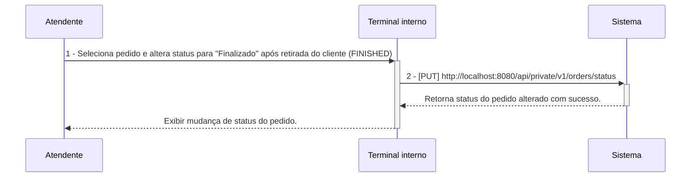

# Tech Challenge Backend API

## O Desafio :triangular_flag_on_post:

Uma lanchonete de bairro está em expansão devido ao seu grande sucesso. Entretanto, com essa expansão e a ausência de um sistema de controle de pedidos, o atendimento aos clientes pode tornar-se caótico e confuso. Por exemplo, imagine que um cliente faça um pedido complexo, como um hambúrguer personalizado com ingredientes específicos, acompanhado de batatas fritas e uma bebida. O atendente pode anotar o pedido em um papel e entregá-lo à cozinha, mas não há garantia de que o pedido será preparado corretamente.

Sem um sistema de controle de pedidos, pode haver confusão entre os atendentes e a cozinha, resultando em atrasos na preparação e entrega dos pedidos. Pedidos podem ser perdidos, mal interpretados ou esquecidos, levando à insatisfação dos clientes e à perda de negócios.

Em resumo, um sistema de controle de pedidos é essencial para garantir que a lanchonete possa atender os clientes de maneira eficiente, gerenciando seus pedidos e estoques de forma adequada. Sem ele, a expansão da lanchonete pode não ser bem-sucedida, resultando em clientes insatisfeitos e impactando negativamente os negócios.

Para solucionar o problema, a lanchonete irá investir em um sistema de autoatendimento de fast food, composto por uma série de dispositivos e interfaces que permitem aos clientes selecionar e fazer pedidos sem precisar interagir com um atendente, com as seguintes funcionalidades:

1. **Pedido**
    - Os clientes são apresentados a uma interface de seleção na qual podem optar por se identificarem via CPF, se cadastrarem com nome e e-mail, ou não se identificar. A montagem do combo segue a sequência a seguir, sendo todas as etapas opcionais:
        - Lanche
        - Acompanhamento
        - Bebida
        - Sobremesa

**Em cada etapa, são exibidos o nome, descrição e preço de cada produto.**

2. **Pagamento**
    - O sistema deverá possuir uma opção de pagamento integrada para o MVP, sendo a forma de pagamento oferecida via QRCode do Mercado Pago.
    - Nesse MVP, será realizado um `fake checkout` para o fluxo de pagamento, sem integração direta com o Mercado Pago.

3. **Acompanhamento**
    - Uma vez que o pedido é confirmado e pago, ele é enviado para a cozinha para ser preparado. Simultaneamente, deve aparecer em um monitor para o cliente acompanhar o progresso do seu pedido com as seguintes etapas:
        - Recebido
        - Em preparação
        - Pronto
        - Finalizado

4. **Entrega**
    - Quando o pedido estiver pronto, o sistema deverá notificar o cliente que ele está disponível para retirada. Ao ser retirado, o pedido deve ser atualizado para o status finalizado.

**Além das etapas do cliente, o estabelecimento precisa de um acesso administrativo:**

1. **Gerenciar clientes**
    - Com a identificação dos clientes, o estabelecimento pode trabalhar em campanhas promocionais.

2. **Gerenciar produtos e categorias**
    - Os produtos dispostos para escolha do cliente serão gerenciados pelo estabelecimento, definindo nome, categoria, preço, descrição e imagens. Para esse sistema, teremos categorias fixas:
        - Lanche
        - Acompanhamento
        - Bebida
        - Sobremesa

3. **Acompanhamento de pedidos**
    - Deve ser possível acompanhar os pedidos em andamento e o tempo de espera de cada pedido.

As informações dispostas no sistema de pedidos precisarão ser gerenciadas pelo estabelecimento através de um painel administrativo.

## Equipe :construction_worker:

- Myller Lobo
- Jean Carlos
- Caio Isikawa
- Vanderly
- Thiago

## Pré-Requisitos :exclamation:

- Maven 3
- Java 17 (Open JDK 17)
- Postgres 15
- Docker Desktop
- IntelliJ IDEA
- DBeaver SQL Client
- Postman
- k6

---

## Clean Architecture

[Clique aqui para ser redirecionado a documentação sobre clean-architecture aplicada nesse projeto](https://github.com/fiap-8soat-tc-one/tc-backend-s2/blob/main/docs/clean-arch/README.md)

---

## Configuração de Ambiente de Desenvolvimento Local  :heavy_check_mark:

[Clique aqui para ser redirecionado para a wiki de configuração do ambiente de desenvolvimento local](https://github.com/fiap-8soat-tc-one/tc-backend-s2/blob/main/docs/config/README.md)

## Configuração do Ambiente Docker/Docker Compose :heavy_check_mark:

- **A aplicação está configurada para o Flyway gerar as tabelas no PostgreSQL. Abra o DBeaver ou a ferramenta de sua escolha e verifique se as tabelas do sistema foram criadas.**

[Clique aqui para ser redirecionado para a wiki de configuração do ambiente Docker](https://github.com/fiap-8soat-tc-one/tc-backend-s2/blob/main/docs/docker/README.md)

## Documentação do banco de dados :heavy_check_mark:

[Clique aqui para ser redirecionado para a wiki de documentação do banco de dados](https://github.com/fiap-8soat-tc-one/tc-backend-s3-rds-iac/blob/main/README.md)

## Detalhamento sobre Stress Testing e Smoke Testing :heavy_check_mark:

- **Dentro da pasta scripts/tests contém todos os scripts k6 para efetuar a execução os cenários de smoke-test e stress-test que foram realizados para configurar de maneira efetiva o os requests/limits da aplicação juntamente com o HPA**

[Clique aqui para ser redirecionado para a wiki de testes](https://github.com/fiap-8soat-tc-one/tc-backend-s2/blob/main/tests/README.md)

## Manual/Documentação de Funcionalidades (Swagger/Open API) :heavy_check_mark:

- **Para todos os endpoints privados, é necessário gerar o token via endpoint login(POST /oauth/token)**

- **É possível acessar o Swagger/Open API da aplicação pela seguinte URL: `http://localhost:8080/swagger-ui/index.html`**

### Workflow de Execução das APIs

**Segue abaixo o descritivo simplificado da jornada das APIs dentro do sistema, esses diagramas servem apenas para materializar a jornada do ClienteXTerminalxSistemaXCozinha, mas em nenhum momento substitui o detalhamento/especificação realizados no Domain Storytelling e Event Storming criados, favor utiliza-los como fonte da verdade**

1 - **Criação do Pedido a partir de um cliente identificado**

**Observação:**

- **Os fluxos de 1 a 2 são opicionais.**
- **Não é necessário informar campo id_customer no payload do POST v1/orders uma vez que esse campo é opcional com base na escolha do usuário se identificar ou não.**

---

3 - **Pagamento do Pedido**

---

4 - **Acompanhamento e Preparação de Pedido na Cozinha**

---

5 - **Finalização do pedido**

[Clique aqui para ser redirecionado para a documentação das APIs e suas funcionalidades](https://documenter.getpostman.com/view/37556926/2sA3s1oXsw)

## Domain Storytelling :heavy_check_mark:

[Clique aqui para ser redirecionado para a documentação do domain storytelling](https://miro.com/app/board/uXjVKuUez2Q=/)

## Dicionário de Linguagem Onipresente/Ubíqua

| Palavra                         | Descrição                                                                                                                                                                                                     |
|---------------------------------|---------------------------------------------------------------------------------------------------------------------------------------------------------------------------------------------------------------|
| Lanchonete                      | Estabelecimento onde a solução/sistema será aplicado.                                                                                                                                                         |
| Cliente                         | Pessoa que realiza pedidos na lanchonete.                                                                                                                                                                     |
| Cozinha                         | Setor da lanchonete responsável por preparar todos os produtos do combo.                                                                                                                                      |
| Administrador/Usuário Sistêmico | Pessoa que cadastra produtos no sistema.                                                                                                                                                                      |
| Sistema de Controle de Pedidos  | Sistema que soluciona o problema da lanchonete, automatizando a coleta de pedidos, pagamento e comunicação com a cozinha.                                                                                     |
| Monitor/Terminal                | No Contexto da Cozinha: Display onde são exibidos os pedidos na cozinha pendentes de preparo. No Contexto do Cliente: Display onde o cliente consegue acompanhar o status dos seus pedidos.                   |
| Promoção                        | Oferta de produtos com desconto customizada por cliente.                                                                                                                                                      |
| Pagamento                       | Ação realizada pelo cliente ao fazer a leitura do QR code do Mercado Pago para realizar o pagamento do pedido.                                                                                                |
| Pedido                          | Pedido de combo realizado pelo cliente.                                                                                                                                                                       |
| RECEIVED/Pedido Recebido        | Pedido aguardando pagamento pelo cliente)                                                                                                                                                                     |
| PENDING/Pedido Pendente         | Status do pedido após uma falha no fluxo de pagamento.                                                                                                                                                        |
| PREPARING/Pedido Em Preparação  | Status do pedido após a após a conclusão do pagamento e encaminhamento para a cozinha iniciar o preparo.                                                                                                      |
| READY/Pedido Pronto             | Status do pedido após a cozinha terminar o preparo e disponibilizar para retirada pelo cliente.                                                                                                               |
| FINISHED/Pedido Finalizado      | Status do pedido após ser retirado pelo cliente.                                                                                                                                                              |
| CANCELED/Pedido Cancelado       | Status do pedido após ser cancelado pelo cliente ou pela cozinha.                                                                                                                                             |
| Acompanhamento                  | No Contexto de Itens do Pedido: Item que acompanha o hambúrguer, como, por exemplo, batata frita. No Contexto do Pedido: Funcionalidade que permite ao cliente acompanhar o status do seu pedido no monitor.  |

## Event Storming :heavy_check_mark:

[Clique aqui para ser redirecionado para a documentação do event storming](https://miro.com/app/board/uXjVK1Bf4Q4=/)

## Domain Mapping :heavy_check_mark:

## Draft proposto para o desafio da fase 4 :heavy_check_mark:

[Clique aqui para ser redirecionado para o drasft](https://excalidraw.com/#room=788c047a84a1804ccff8,z7B6WGLVRFSn0qvuE8mKnw)

## Desenho de Arquitetura/Infraestrutura  proposto  :heavy_check_mark:

[Clique aqui para ser redirecionado para o desenho de arquitetura e infraestrutura](https://viewer.diagrams.net/?tags=%7B%7D&lightbox=1&highlight=0000ff&edit=_blank&layers=1&nav=1&title=fiap-arquitetura-s4.drawio&dark=0#R%3Cmxfile%20scale%3D%221%22%20border%3D%220%22%3E%3Cdiagram%20name%3D%22Draft%22%20id%3D%22jiXIkiBsy346j2COqR-b%22%3E7V1bd5u4Fv41WSt9MEsSiMuj49TTnmnPyTSd6cxTFgbs0GLj4ZJLf%2F2RuBkkYXAMNklJphkjcxHSt7f2%2FvaWdCHP1k%2B%2FBeb2%2FrNvO94FAvbThXx9gRAEKgLk%2F7ToOS1SEJDTklXg2mkZ2BXcuj%2Bd%2FNqsNHZtJ8zK0qLI973I3VYLLX%2BzcayoUmYGgf9YPW3pe3alYGuunEo1aMGtZXoOd9o3147u01IdabvyD467us%2BfDFUj%2FWZt5idnNw7vTdt%2FLBXJ7y%2FkWeD7Ufpp%2FTRzPNp81XaZ13xbVCxwNlGbC5zp5w9%2F3F4Zi6f404fNzPi5Ad8nOLvNg%2BnF2RtntY2e8yYI%2FHhjO%2FQu4EK%2Berx3I%2Bd2a1r020fS7aTsPlp75AiSj2EU%2BD%2Bcme%2F5ASnZ%2BBty2hVf1fyxThA5T6WirOq%2FOf7aiYJnckr27QQrWc0yJE1kJeuDx12%2FIE1W08L7UqcgqGWlZoaGVXH%2FXYORD1mbHdB%2BeR3atR9tIDOwMpRD2py2Gd4Xbbt0PS9vugskzzH9LRo1x59MSlaeGYb5Vf4mKl2V%2FnBdQb5Rkx96dWDarrO7qsNukgGodBOEol5SAd9LMjRgT71kcH3i2ETKs0M%2FiO79lb8xvfe70qsq6nfnfPL9bdaV350oes4604wjXyQJ5U6rbd%2FQjwPL2fMCOD2P1npvLwSOZ0buQ1V3iZozu%2FTGd0lVit6DMqzKGCmRcPUukRmsnCi7kOmXoiYv7yrcsT5iRGqJ6e%2BLhKaQ1AM79xDh4XQcwLz0QMQLD9TlnmQHNXcIGdm29KO7TgbTcvPTl3fJaDr13NWGlEVUeIrST%2BbC8W780I1cn3678KPIX5MTPPrFlWn9WCWdXe7A5IeckjxsGm7TQZ8iwcwPlu4T7airrD7X91FErYUpbQg0t%2ByNIrnEXli6BEaBZJEnorltRib5Hy0PaTu58WThkQpMQt9yTY82w5xqrfnKje7jxQQiXdpuVv1BAWsMFBAPBUUw2Cl9DXUyB4Tf3OhDvCBlU4t2YMgBg7xsVMWDmeHAIk3jBAKArF3bTvSvSK6rkk9FONO%2BqDjOHt6jjEKV0ZEa4mUUKIIBDvRlhBwuoi%2BVQNtZmrEX1Uq2WAYrYiqWygdygh%2BEjvMjE8jH7YTIYkR7Cs3jreebNhVMBBAB4hyQIX2e4m%2BSoW%2FyiQzQk7%2BS%2B0jhw2rSr3zKmIUBb%2BhACAWqGvZl5qgcDmYfyY1m5BO4cbeO5xIz75eQUXYchVhvN472JqMt%2FIQttamS5%2BIr8h%2BQKMRmIPmHyQmzpNDQaYFEHbdSeXIkaZA5WSWPnTGF6ZkGFpSqRSH5r4WSCH84kXWfdXXjqM%2FpBg5oSQs4wfsHJ22IBCGZ5lo%2FrSjHIFluaPnQkOIwuYSx7wDAQOPtuMzB6QVtBjQYsKkKrwkULNAECu4JbTl7UoLbF2flkvcnRg74SDUw0bFg45M%2FMyKSJtEMAfmcnfR8Di3Ru1YwmH5CKj9wQ0MwcCt9KQUoYl%2FUZHglZpW6ipI3TwtoG1X6RP039vMvJmGiY8lYCkgrPaWXZd%2FnN7r2rR9JJ3%2F4s7gpqXV63%2BqzSHHp%2Ba%2Fd2geN1n5m468d2zWJz0uNtzlSii%2Fuki%2FuKgceMTbu7KRJ%2B%2FYFoKwzwNVVHrhIFyiYvLB75Ircwo6A%2BmcYX8zkiykMXD%2Bkpgs9upouPNJdYQNybffhqGd39hKX3xwiQvOvfkQ17fyzv3DJnYirtN2%2Ba5a%2B5DVq5O8NqGJdlZkh0%2BDNs9wBLgM6H1m7x7PGtfMJKMKl5z9ON0RxZRpR3OBhZAbRlMYyypYMKZu79CWTh9d2SkrX7XvzTJf0zS0qoOowqbJWvUVKgvZGLEKRl9yRsHOD9sfNKnBCqrw%2BmxsyLNnikfV1qDLu7T4RX5xcQPSOubGoSXHwuzWouIpfwbpFAp8IiRwlUZnGF0L%2BNN5nSp%2FAForKNL4Q1vhgSOSCico0zNeYvRoKrobM1YlT58cR5QFmRbxUEEIiv3MqWqx39f5agwBw3lXZUKvEsxotvxpHkR3PyipzRygQG6Q6XgnNQtZ%2FNB9DRSLCmWibjxatzxU5TD9VzyIKLyTVu6Pc090iQbvbn5kny5rEWHqKAnlDTxThLAq7HxjxOQZG0orB89%2F0egnnh%2F9kt0sOrp8qR8%2FloxsncMnLU%2BRcA2Fvicfd0ihr0fCqazEDLdzX0eUY3t%2F%2FDbD55ffZf%2BHz92%2BLT3%2B%2F%2F0de5Px584CsdD0gtwXA%2F1QUP5rX3urPycL52%2Fhz9vH%2B5wQC9RwIqHYarum07%2FF6m1dklVizwrZ7WdA1tYy6D7IqetUSgpg1hXqOseZeocAUCrfm5ihj4Yvzb%2ByGbuLAaYnjhh1qB334%2BvXm8rbs%2BqSPGpCTw5CF5bFvF%2FboRfUrOhNTgrJ8ZodIaRNUGs200UwbgJn2I%2BxLMKGeX5NJpi4beUJMSTR1QZhP72BAFksmnyIz%2FXZLCt7%2FTv%2FOvDik3XG2OJ8itrm66I0imSzvDYXvC2hAIAmCLVpv0XfRaMo0fkXcylYOj3pZsjw%2FtnmpnmMdy3uy9yrP6CmuqlfjqhDxkS5kCMKqUDf6av2B5PaJrNOXm564pa%2BQp5%2F2Td5N1GrsDLW0WIk%2FZT6XTsuMhPrnILlqCWG1fLvGelVPJx%2FSCnSbocjHVjuznq%2BdrefTBvu4WQamQ2AWRzGN2Y5Ws0gdqYpUdaUmojyPvuxmoZcviouN%2FMmB%2FMnekGNZKQq7AJ5GJ7JBLMhk4NbEMwSBkeqgqsDe2ABxcynDGEEr%2BdVnYegEITPheZ1HzI7SOC1m8Aidyb5dQKFta27du5UZOY90VGYt3Gtjqimw3sLtYMyQMZL0qhMB82TBshMBdAkJnAgIO%2FAi9rHDfRgV05uP5OvfslYfpCkR%2BFEu6fvmQbWbtMH6Q2J10yPGEJT0aiCnYAPKGFMFdglrV3eGLz43eMBawjPXC9u8W8YbK32C0BdWeu1FQ6l2IZR1AfNTeMBVLdFXL%2FZI3H8y1xvS6OSUaUzeblQTfasJA6mM94K0c2sJ2OMw9BdBRoIv0uFhmGT2EWuAVHMb09S%2BWsSVsmGqRUfX6Mrz%2F40dt1on8vysWoH7QMbMhnoNKlnvTckHVqpUEBTM95ahQDqMvmy0M%2BdCFAeJJ79z7I%2Fz5RvdrtquPEMmQ01EHeRm%2BXNugTHpMDW%2B%2BKH0JPcgDAwGVccRjmLYiWy3jlTg7N5cm1TtJbrP2dh5GHd6Bn18%2BZuTzE%2F5z7ev74rRwTcTc2QeEdxuDlTGPVa1GM32VXb%2BkJw1DiLnG0RQlaRTBBFDJZ%2FfU5060cGEenFCVbMnVl0xpGGFg1J%2FGaBFW5dXDin1baXNuQYWdMOe%2BSoGkHQFFD%2FVEDrUsCxhnnNRSLFmCIxdgCSjg4lyws4Q0fV9pU2b2%2B0ksiYL0%2FrhL5eu5UxC5aV54X2neE%2Fut%2BYL6tagyPisj5oJpBXWIcF%2FWMX%2FC5kIRpkhXcPvEae0yoky3KRcAHA6V1ZmUoqyfB92uq6wVDix16i5sZZcLRlGi7wmpDPnJslELMnyI144wYaYhWEyNY62wK4oadKsH7ZBlnBD4VAfxjtOXaiaKiG0UxdVjY0AVkTEizgNmrRKB5nQQlVR7xpz0nG0PN7877qY6bYIOCnlSl4yj3MUxsEKYyF2W9%2FuTewwGW8Rw3HqxjBkrUXy6QjfEb4sfDUNDAK%2BLRYxG%2BE7wpfTvkgeBHzr%2Baa6Oal7PYoD7CCwKFaBmFgpBOn37oaA2vSEDxJ5VRPb2TZ4L6Ob8ipls8FNsdP8SZHQcpRZX1KMDdEUgdNLsWjFqSP9FYhr%2FJXQsQInErgspNgmjUmEN5wEdtPqHaO%2F8jqlspC%2FFAedSBZQJFD6QQwpgKCEiaTlP7zAYSQBwZI4uIPgoJjWPWjl2tfI6yqqLBnyrs2rqfdQ04n1grkea8HwIgMXCVPd90u9NdMbxUujQCO5O%2Brnoejn85G7moIljcmFBKJkyJObR7AH%2B2jkc0f5OxejoCIk6fWjs4EGIXQt5sqOOB5xvMfKNATLbJ8ex8aI4xHHx%2BBYzx3Rs%2BIY1c9lHi7Vm3lXI8n7VsVzWCRvgyCrea7xeQVZlFU4sr2jeL4KthfrkGcJMCzE5Yy0bm7YvV1a19CYdQw0FQyRyEX1CXi9Ebl%2BYDvByOSOuncouveMaboIK3uy%2Bom%2B5pfeOYMdVL%2FK%2B8jqjrL46lgECGUosdSBMQhJG5McR%2FAeDl5NE2yOdnrwtlgOZQTvCF5W86IhBB9QfeR6uKRt7kmNrO1bFcphsbYi8VXzqYXnFd%2F6RZxGqnaUyYFTtRDsndxPxgp9CLStLApsvinaFmoqs42MphkSGB5vK9eHpnrjbbfm89qhtxiZ21EVD0MVn4%2B5RUBR96psTR3EhCVZFGobudtRGl8rg2AgWdJLiSPMeoYGHIjciQKrI5RHKLeHsmagYUB5XDhkhPJxUNYVPAwoi%2BJrQ2d5d37XyPO%2BVSEdGM%2FbIM4qnSg%2BBHGun4Y8sr6jhA6d9dV1tJdCUDQJDID1FU3LeiFhUDMIBqvFJaKLCM%2FoyaUP74SSOF2bP3261PSX69vDaceDl6nuptKXRAijVeDc%2FvGpfsPuVsN4RScctKVxzZLQ9cLNqoP8Rq02sCmWy2ZVTaGD9u1hIwodlDdAFq2yTXWgu1llI6Nw9%2BNt4NuxFWWbHxdCXd0h2d639%2FGRS7AQSxjptUuwKFAQTc23Da%2BMq1pvy0QCDnGD2fzVeXKjv0ufS5s2kKPdng30IN%2ByIX0bZruExr3s9q0yXt6jYY%2FK5EFw7JYMZMSQZGZKBzIUKQfIobskQk03uBvKAHA37G63RDHk4K8Juc4RohIwGEq1P6FaGOuH4kN0O1lX2dv1jQ6ebvol0NFC0aTbqfWgaAyiFxhzFMqKhIwXKhrRDWVscDfsG0ry24JSp1sSd4lL3A8uDQPyuMRH4FJ0Q1k7PS5b5P1XzH7W6xa4y0jkQ4vKNL4Q8qeJfGmRgy0q0%2FhCyJ%2BWEgFYUCgq0zBfY%2FZqKLgaMlcn%2Fv9BXlTZKfKoRT6xzeDHJT0FoaXspI5g4kZp1nL5bq%2BH1fdWoGWXCTEuE30kzziJvKbASSUqc5vIochvsn0rpky1vbh7dKP7u7W%2FWfnkwPLXWyL2C9dzo%2BfOGEpVKq8fUM1KFftRuaBX%2Bck9Wug4P6oHcrKJk6jCMQNZAscHM7icTFZO8mV2SY5TiOjvuway5Trr3evFQQxnLQ%2Fzmhrh8jOFMn1zML35%2BO4FDdDA6fS8G1mtxlqa9LdoBMemv%2B86ktGU36wKJs59vZJgIkWXBKIp98VoKvVzPUZGc2Q0R0bzoJV8oL4viFGiC85IadbPDhkFfhT4UeAPmwSGNKmNuX1iGe8wTNk40eDWCR5cq9iBdpcLcCncOSV8sMoC0zwv4eRpAakjWYvyMS2gOS3gwRJKnMe0dKEoekncUaAm2DtlCDM0sWjy2NnkM1%2FucpTMUTJPIpmKrrK%2BMFThEJYPx6ecStgomMWSBqNkjpJ5Esk0NLmyKRJkhBTgIh3ivHKKhiSnpaT0UVJHST2NdavpxPMsiSqzxuowxlO13tA9mLdh5fR%2FWycwL2byxVSjf6%2BwE5LTbSKnwAmtwI1MUmXPcaOYnIbAxqcBi2%2B3Oc8EJuRfRuKEt398qiVxThudYCiQ0qoQbPCCyOAc098LjiFKfzipzfihppUlxKxSB5jFUOdSqJBguTYZy4mMs1BlM%2FG6g2n9yr8jTH85mEKgkTEG18bTkc4vj4mwLuWhtDJkdbkvyNavQ3tGyArj4iNOe8Kpjo194SYk4LoQxkLVqvW1OI8qii8zGHjd6yTpSh7UKxpeFSiIfLptxfaCqpTvLNt9y9cH%2BgY4vzdwbDds8JzG%2Bbyv0nEa2HxeWZaM%2BmQ5qGhSrqLOu7t6vet0fLaYYLEint6oLxmn874pAT3Jqhga8emUWmoRydQ35JNjVD1JT2YlT%2B2NsGixbre7NlcOC2AO3iVEV3F0LVJsbGpy9oxrd72itra7oG8TWiaxwecz07p37r7QAfPuJs1%2FkMKHVTf9hOQUQRWdaIiWOMiDmBUPHfWlDesDM0e7O5xaTWwRSuU22CN7HZtR3w1f39UxuV3oO4U0HxM%2BGcaWnBqv0cZ5Xz3M%2B1L7mY%2BIAOdvAsh4722nfCEgSxAxyh6obac8T4PAfC6dlumPPVXnH5fX%2FaAqZgt57qQgrUmn09Bys%2BMkI840WJs%2FnQ3l1a5iMsyTi78ScaFP%2Bc%2B3rxd0PsL81gnDhJSTKd%2F2ZxgnBzBw%2FWOGqX75ty4MEp2oeL3OX4O6tkvyOuM0Cr3HQBeHlr9IF9lmGRvkb46bKkxs%2Bif%2BVbACAa6qCqIp%2BDCoAk6MjVPariM26uZmAINYl7V6RFZxhRbiVcrJYYMEsOmIOR8EcQ5VJDPJ8zJQkCTYV%2BD07LleHxIeIntuLhZutP53XBTzrfqsAyPRMbGvMCO6Mh4Gc67Xh8Z7Yc7HZf5%2FXbE8DXWOqOlSl%2BonA5W3cU%2FNm%2Bv1Czz0wM%2Fmo91I0b55ueqTosVYkXCVo0WazFv%2BZxjCNA6sI0fbA0ebWvndr82lQiaEZgAGKq1X5VKhJqkMAWoI1rnsiKMVPy%2Br%2FSGVlAECjBz0wNLq9TOdu7f1RqvuVxt9erXqVNaBGoAdZ5wy62iUp1GeupMn1SC1hnWriQ9DulpQunlz5llGjWBMpp1dFZRhjjPbWZpxIjU1CyWy4pI8cJqXgotdEtJ9FG3DRJbnNBmJWJWP7g%2FJIk9Hc9KvEe0hNI%2B3nm%2FSLT%2FmyXX0Q%2B6o6SoE0vdtRylKUJUVpm%2BBoG9RYZFUMpS0vvr2FSynuzPT%2Fyl902iyU61UNtqpFnmB3R4SEzUiNqD%2FSAosGl5wrbx47nr5K7U37xvXqM%2FFq9kPUPvxAxAQrB2tHLFGr%2BiGstp6jd5DvQGDkTRoAGNvBdkLkH4KLyCfVPh6ZA%2B0lT06cL9K2cvjomeTPcA4pNB4aZoUTTJhUM1GfbvKkComYhWVRtreunFXnEji6rOjxMHOeuu%2FtRuh1rgRXxzLWSSTEx8ISpPMBnpELJOlG6xLExnTtIetuTLX2YmXt7HlhCH96Mfkz9z07s3DlrRl9E6%2FeRD75y8uMf29OHD%2BYgcWmaGzGBSwqIoui%2FInINgj2sdZZHsXnT4tRm%2FihecmOThVkG4d203ycJa%2BSzEbuCY9nKXNT893N67lmgE9xYufdhfuUDyC9TiwqoJ5sqcHa%2F06zOMSBL%2Fe1G5F1yTEGB2DWHfAEM0qrqEwlp7zlNmcxCq1efOzkpxWt0h7WVdwVJqa%2FBxgufJN3jClKS872hU0iDHPxlXUF%2B8hpCDR3U68G5Uhir6MYGixp5QiF8xjMQzlK%2BEcTgpoqPluPUMBgr2Rg2FYW6NLcDIrC2oKo550wTSNk5tZxZ2HANMax7XwCcreQOoGjF5Af%2FhU9QG4ATAPW41D6mFDKgKKwltE%2BKX2lW6oorud2L6CQDQLYURDs4GlGxpvEqkvNLCoCm%2B%2BW%2B9YGECQI9HUgiDH93i9zSuySgaBtgipRhKc6ecPf9xeGYun%2BNOHzcz4uQHfJ7CfAAHG1R6FmE3n7L1H8dij3YZ88g3Vii5V2sVpuuvSASTuvqku1XOh3Elpu1D3C7pU%2BGJyvcNwNDH7xVkFZsHFfvEjh7PmRRtKdbELFref1Rc%2FjuhmS6QeseeER25q9WtzvwIB4pyVWs9EkZmpySDfJ6o8JQHnGR9l68noYC7yHuk%2B0Xr7Hzc00NC0GOS4jP4rzwVNdnZrsYx%2BkOK7UCCes4y6kTRDq86kMwQM1enn%2FsAsxerENkT3OUciG4Tv7tNnJsHM7G7MTNJq4NPapjkOBxCc35ZUWtiSdMPK9h3JaEYbO7qtiDSjjhbykWTD0f4ExPwOcuwm6W1ZBMxsfUAsWSZI29UULgAZz1bJVtCqr9r%2BC%2FrJIYP5FiXnBnhb5DbIgRlYAnybjr60RPhWLd1ZLM%2BKb4VzruQXpkhidq1DjHuan8jVWW4Cdx6ZfPEFOVPUszS0YP6r6%2F0QwJW3z614LIIle6rA1y%2BYNX5aOUdlErjGBaLVuDEjYgdskscgoF90ErKZwKoC1SHvF5HqCeI1SIEMadCZZ5Tnu%2FdDD9hu4FhE2xTR6SIpMHGRJnT2TeB7HrG5aCFt82Jlr98L25scXL7%2F%2FbbepR%2Bd966cd02v6g4tX8a9EvdAwmlnL%2FDe6Rwrn2Jmp4mo3%2FXZt%2BkSQe%2F%2FDw%3D%3D%3C%2Fdiagram%3E%3C%2Fmxfile%3E)

## Documentação do Kubernetes

[Clique Aqui para ser redirecionado](https://github.com/fiap-8soat-tc-one/tc-backend-s4-k8s-iac/blob/main/README.md)
